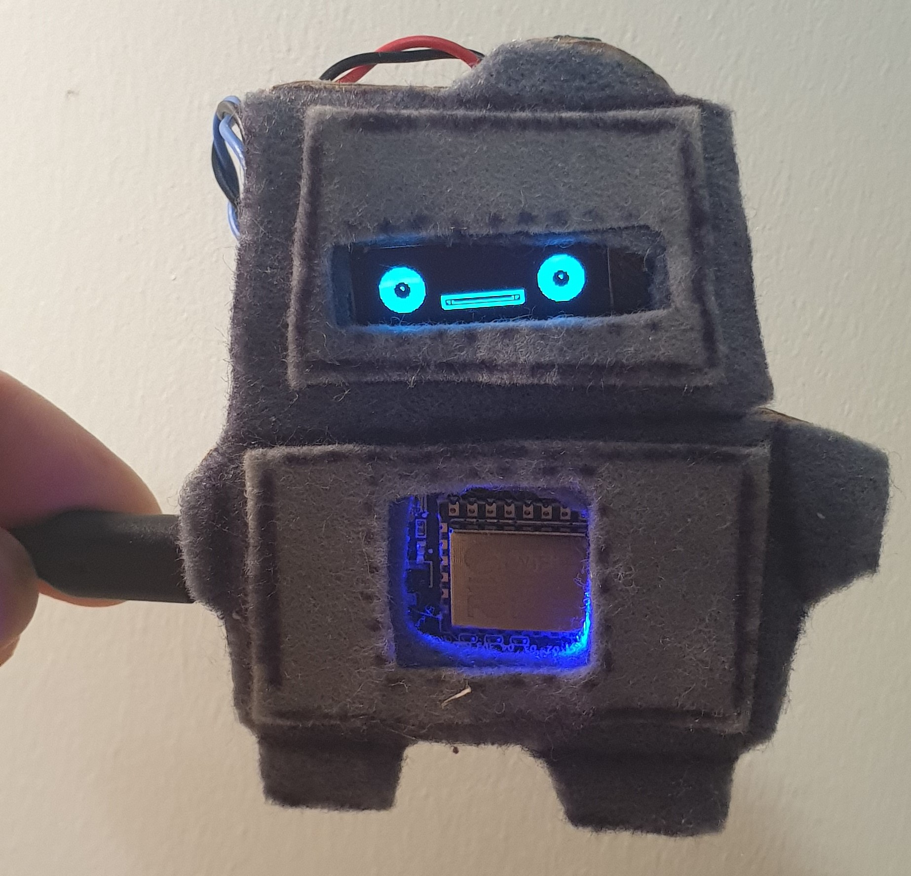

# esp-bots


## bot-bot, the friendly robot fire-hazard


- has multiple personalities
  - weather-dependant
  - user set message
  - user set mood

- bot-bot listens to hass to override his emotion
 - listens to text select in homassistant
 - supports [neutral, happy, sad, cry, lookleft, lookright, sheepish, sleepy, cheesy] 
 - includes [smile, smiley, smiler]

- bot-bot has a friendly pair of eyes that change depending on his mood
  - bright-eyed after some comes up
  - sleepy when the sun goes down
  - scared when it's thunderstorming
  - satisifed when it's raining outside
  - on & happy when someone comes home
  - off when everyone is out

## hardware
 - SSD1306 128x32 display
 - bigsound audio sensor board
 - nodemcu esp8266
 - cardboard
 - felt
 - wire

### notes 
an automation in has to read from the weather.home state, botbot expects:
``` 
‘clear-night’
‘cloudy’
‘fog’
‘hail’
‘lightning’
‘lightning-rainy’
‘partlycloudy’
‘pouring’
‘rainy’
‘snowy’
‘snowy-rainy’
‘sunny’
‘windy’
‘windy-variant’
‘exceptional’
```


to get these going in esphome add on for hass

```sh
git clone https://github.com/donbing/esp-bits.git /config/esphome/bots
# link the esphome yaml files that are in use
ln -s ./bots/src/botbot.yaml botbot.yaml
ln -s ./bots/src/bobot.yaml bobot.yaml
ln -s ./bots/src/components components
ln -s ./bots/src/components/images images
ln -s ./bots/src/components/AlexandriaFLF.ttf AlexandriaFLF.ttf
```

 